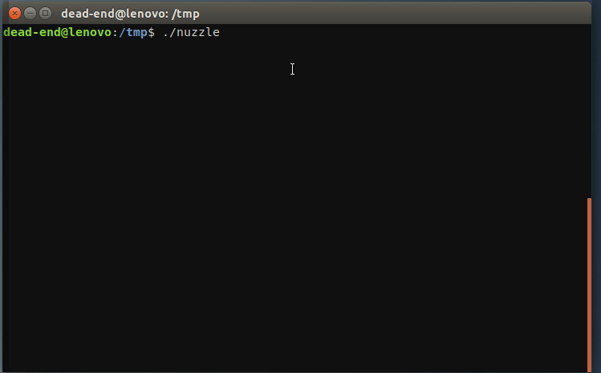

# Nuzzle (N-curses p-UZZLE)

Nuzzle  is  a  terminal based puzzle game. It is implemented with ncurses
and requires color and mouse support. Playing is simple:

- Start the program and start a new game.

- Use ESC to enter the main menu during the game.

- Click on the block of squares to pick them up.

- Move the block to the desired position.

- Click again to drop the block of squares at that position.  It  is  not
necessary to hold the button pressed while moving the blocks.

-  If  more  than 4 adjacent blocks exist, then they are removed from the
game. For each removed block you get one point for your score.

Nuzzle uses the following directory to store its data:

$HOME/.nuzzle/




# Installation

To install nuzzle download the latest released sources:

[https://github.com/dead-end/nuzzle/releases](https://github.com/dead-end/nuzzle/releases)

Then build the program with the following commands:

```
tar xvzf nuzzle-0.1.tar.gz

cd nuzzle-0.1/

make

chmod u+x nuzzle
```

Now you can start the program with:

```
./nuzzle
```

# Uninstall

To uninstall nuzzle simply remove the installation directory and the directory which nuzzle uses for its data: 

```
rm -rf nuzzle-0.1/

$HOME/.nuzzle/
```

# Dependencies

Nuzzle uses ncursesw which is the wide character version of ncurses. To build the nuzzle, the following list of dependencies is relevant for ubuntu 18.0.4:

- libc6 (>=2.27)
- libtinfo5 (>=6.1)
- libncursesw5 (>=6.1)
