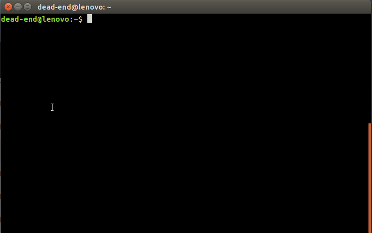

# Nuzzle (N-curses p-UZZLE)

Nuzzle is a puzzle game for the terminal. It is implemented with ncurses and
requires mouse support.

- Start the program and start a new game.
- Use ESC to enter the main menu during the game.
- Klick on the block of squres to pick them up.
- Move the block to the desired position.
- Klick again to drop the block of squares at that position.

The program uses the following directory to store its data:

  $HOME/.nuzzle/

# Installation and requrements
